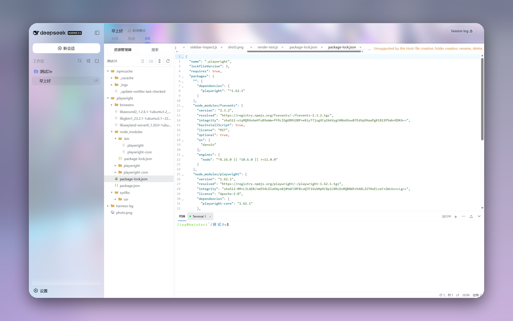

# dsh-code-ide

[简体中文](README_zh-CN.md) | **English** | [日本語](README_ja.md) | [Deutsch](README_de.md)

  

`dsh-code-ide` adds an optional IDE workbench to [DeepSeek Harness](https://github.com/deepseek-ai/deepseek-harness) without replacing its official home page, Chat view, sessions, settings, or tool UI.

> [!IMPORTANT]
> `v0.1.0-alpha.0` is a GitHub **prerelease** with a prebuilt plugin package; it is not published to npm. The current `main` branch has been compatibility-validated against DeepSeek Harness `0.1.1-rc.2` (tag `dsh-v0.1.1-rc.2`, source commit `b150a551b8d465e31e418e1b2eaf5e79bbb7d28e`). Other commits and future npm RCs are outside this compatibility promise.

> For the guarded, Chinese-first assisted-installation prompt, see [Quick install](README.md#快速安装推荐). The manual steps below remain the supported fallback.

> **Quick install:** `dsh plugin --profile web add github:SakalioLabs/dsh-code-ide`. In a Harness source checkout, use `pnpm dsh` instead of `dsh`. This repository commits a prebuilt `dist/` tree that is kept in sync with the source and defines no install-time build script. A GitHub install therefore does not rebuild the plugin on the user's machine and needs no `dsh-code-ide` `allowBuilds` entry.

## What it is

Installed Harness conversations gain a native, optional **IDE** tab. Chat remains the default. The IDE is created only after that tab is selected, and the normal message composer is hidden only for the session currently showing the IDE. Switching back restores the normal conversation.

The workbench is served from the same origin at `/dsh-code-ide/` and embedded inside the native tab. It receives the owning session's workspace and follows Harness light/dark theme and `en`/`zh` locale changes. The integration is additive and does not fork the Harness client.

The UI follows familiar VS Code workbench conventions, but it is not Code - OSS and does not provide the VS Code extension host.

## Feature summary

- Lazy, bounded Explorer with file icons, retained expansion state, accessible keyboard navigation, and validated workspace-relative paths.
- Full create, move/rename, and permanent-delete support for local NTFS workspaces on Windows x64. Linux x64 Hosts that pass the runtime `openat2` probe, and local APFS workspaces on macOS x64/arm64 that pass the runtime `libSystem` probe, support file and folder creation only.
- CodeMirror 6 editing with 20 language modes, tabs, up to four editor groups, top/right splitting, drag/keyboard tab reordering, per-document undo state, line-ending and indentation controls, word wrap, and dirty-close confirmation.
- Source/safe-preview switching for `.md`, `.markdown`, and `.mdx`; the preview renders the current buffer, including unsaved edits.
- Read-only previews for common images (PNG, JPEG, GIF, WebP, AVIF), audio (MP3, WAV, OGG, FLAC), and video (MP4, WebM, MOV). Audio and video use native browser controls, byte-range streaming, and never autoplay.
- Version-aware save/conflict flows, deleted-file recreation, browser-local hot-exit recovery, and polling for external changes.
- Quick Open, workspace search, regex/case/whole-word/include/exclude filters, result navigation, and preview-first replacement. Replacement changes buffers and does not save automatically.
- Command Palette and editable one- or two-stroke shortcuts with conflict detection and browser-local persistence.
- Multiple named xterm.js terminals rooted in the workspace, with find, clear, rename, restart, interrupt, and terminate actions. Collapsing the terminal panel only hides it; it does not unmount or stop the PTY.
- Resizable panes and a compact accessible layout at 760 CSS pixels or narrower.
- English and Simplified Chinese UI synchronized with Harness without reload.
- A standalone `/dsh-code-ide/` route for diagnostics. Normal use starts from the **IDE** tab at `/`.

## Requirements

- Node.js `^22.19.0` or `>=24.0.0`.
- Corepack and pnpm. This repository pins pnpm `10.17.0`; the supported Harness checkout currently pins `11.7.0`.
- DeepSeek Harness `0.1.1-rc.2` (tag `dsh-v0.1.1-rc.2`, source commit `b150a551b8d465e31e418e1b2eaf5e79bbb7d28e`).
- A modern same-origin browser with WebSocket, `localStorage`, and Web Locks. Without Web Locks, recovery ownership and shortcut editing become unavailable or read-only.
- The platform binary from `@vscode/ripgrep@1.18.0`.
- The `node-pty@1.2.0-beta.15` peer supplied by the validated Harness Host graph. Do not install a second native copy.

npm currently publishes `@deepseek-ai/dsh@0.1.1-rc.2`; the current `main` branch has been compatibility-validated against that release, its tag, and its source commit. Pin the tag or commit below when you need a reproducible environment.

## Install from GitHub (recommended)

Use the same `DSH_HOME` value for every Harness command in one installation: `plugin add`, `plugin list`, `--dump-config`, and `web`. If you set `DSH_HOME` explicitly, export it once in the shell before running the following commands; using another value later selects a different profile store.

Prepare Harness:

~~~sh
git clone https://github.com/deepseek-ai/deepseek-harness.git
cd deepseek-harness
git checkout dsh-v0.1.1-rc.2 # b150a551b8d465e31e418e1b2eaf5e79bbb7d28e
corepack pnpm install --frozen-lockfile
corepack pnpm build
~~~

Install the current `main` build directly from the Harness checkout:

~~~sh
corepack pnpm dsh plugin --profile web add github:SakalioLabs/dsh-code-ide
corepack pnpm dsh plugin --profile web list --depth 0
corepack pnpm dsh --profile web --dump-config
corepack pnpm dsh web
~~~

The checked-in `dist/` is verified by CI. This command does not run a plugin build or require an `allowBuilds` entry, but it follows the rolling `main` branch.

For a fixed, auditable, or offline installation, download the Release package and checksum first:

~~~sh
curl -fLO https://github.com/SakalioLabs/dsh-code-ide/releases/download/v0.1.0-alpha.0/dsh-code-ide-0.1.0-alpha.0.tgz
curl -fLO https://github.com/SakalioLabs/dsh-code-ide/releases/download/v0.1.0-alpha.0/dsh-code-ide-0.1.0-alpha.0.tgz.sha256
sha256sum -c dsh-code-ide-0.1.0-alpha.0.tgz.sha256
corepack pnpm dsh plugin --profile web add /absolute/path/to/dsh-code-ide-0.1.0-alpha.0.tgz
~~~

Windows PowerShell checksum verification:

~~~powershell
$asset = "dsh-code-ide-0.1.0-alpha.0.tgz"
Invoke-WebRequest "https://github.com/SakalioLabs/dsh-code-ide/releases/download/v0.1.0-alpha.0/$asset" -OutFile $asset
Invoke-WebRequest "https://github.com/SakalioLabs/dsh-code-ide/releases/download/v0.1.0-alpha.0/$asset.sha256" -OutFile "$asset.sha256"
$expected = (Get-Content "$asset.sha256").Split()[0].ToUpperInvariant()
$actual = (Get-FileHash $asset -Algorithm SHA256).Hash
if ($actual -ne $expected) { throw "SHA-256 mismatch" }
~~~

## Install from local source

Build this repository, then add its absolute directory path:

~~~sh
# In dsh-code-ide
corepack pnpm install --frozen-lockfile
corepack pnpm build

# In deepseek-harness@dsh-v0.1.1-rc.2
corepack pnpm dsh plugin --profile web add /absolute/path/to/dsh-code-ide
corepack pnpm dsh plugin --profile web list
corepack pnpm dsh --profile web --dump-config
corepack pnpm dsh web
~~~

This is a development workflow, not the recommended GitHub installation path. To install the prebuilt `main` branch without a local checkout, run:

~~~sh
corepack pnpm dsh plugin --profile web add github:SakalioLabs/dsh-code-ide
~~~

The repository contains CI-verified prebuilt `dist/` output and no install-time build script, so this command needs no `allowBuilds` entry. Use the fixed Release package and its checksum above when reproducibility or verification matters.

## Configuration

The package's `dsh.bundle` patch automatically inserts:

~~~yaml
- insert:
    - id: dsh-code-ide
      name: dsh-code-ide
      config:
        maxFileBytes: 4194304
        maxMediaBytes: 536870912
        terminalShell: auto
~~~

Do not also copy `examples/dsh-code-ide.bundle.patch.yml` into a user patch: it is only a reference and would duplicate the row. Inspect `--dump-config` after changes and confirm exactly one IDE entry while all official Web entries remain.

| Option | Default | Meaning |
|---|---:|---|
| `maxFileBytes` | 4 MiB | Maximum editable UTF-8 file read/write size. |
| `maxMediaBytes` | 512 MiB | Maximum size of one read-only media preview; configurable up to a hard 8 GiB limit. |
| `maxDirectoryEntries` | 5,000 | Direct children in one listing. |
| `terminalShell` | `auto` | Uses `COMSPEC` on Windows or `SHELL` on Unix, with fallbacks. |
| `terminalArgs` | shell default | Explicit shell argument vector. |
| `maxTerminalSessions` | 8 | Host-wide active/pending PTY limit; maximum 64. |
| `maxConcurrentSearches` | 2 | Concurrent managed searches. |
| `searchTimeoutMs` | 30,000 | Search deadline in milliseconds. |

Other bounded settings are defined in [`src/host/plugin.ts`](src/host/plugin.ts). Structural-operation limits bound admission and recovery resources; actual availability is determined by the reviewed Host backend and filesystem. The route prefix is fixed at `/dsh-code-ide`.

## Usage

1. Start the `web` profile and open `http://127.0.0.1:3080/`.
2. Open or create a session attached to a Harness workspace.
3. Select **IDE** in the conversation view switcher.
4. Open a text, Markdown, or supported media file from Explorer or Quick Open. Markdown can switch between source and preview; its preview tracks the current unsaved buffer.
5. Use **Search** for workspace search and replacement preview; save changed buffers separately.
6. Create a terminal from its toolbar. Commands run as the current local user in the workspace.
7. Return to Chat whenever the Harness composer or conversation UI is needed.

An unavailable, loading, or unattached session workspace produces an explicit status instead of selecting another workspace.

Opening `http://127.0.0.1:3080/dsh-code-ide/` directly starts standalone mode with a workspace selector and Harness pane. Embedded mode omits both because the parent session supplies that context.

## Default shortcuts

| Action | Windows/Linux | macOS |
|---|---|---|
| Command Palette | `Ctrl+Shift+P` or `F1` | `Cmd+Shift+P` or `F1` |
| Quick Open | `Ctrl+P` | `Cmd+P` |
| Save | `Ctrl+S` | `Cmd+S` |
| Explorer / Search | `Ctrl+Shift+E` / `Ctrl+Shift+F` | `Cmd+Shift+E` / `Cmd+Shift+F` |
| Go to line | `Ctrl+G` | `Cmd+G` |
| Keyboard Shortcuts | `Ctrl+K`, then `Ctrl+S` | `Cmd+K`, then `Cmd+S` |
| Toggle terminal | `Ctrl+Backtick` | `Cmd+Backtick` |
| Toggle word wrap | `Alt+Z` | `Option+Z` |

Explorer uses Arrow keys, Home/End, Enter, Space, `*`, and printable typeahead. Focused editor tabs use Left/Right, Home/End, Delete to close, and `Alt+Shift+Left/Right` to reorder. Terminal Find uses Enter for next, Shift+Enter for previous, and Escape to close.

## Limitations and security

- This is an early, source-pinned local tool. Other Harness commits, moving branches, and registry RCs are unsupported until tested.
- Windows x64 uses strong handle containment on local NTFS workspaces and fully supports creating files and folders, moving/renaming entries, and permanent deletion. Linux x64 supports file and folder creation only after its runtime `openat2` probe succeeds; structural operations remain fail-closed on Linux ARM64 and other architectures until a fixed-signature `openat2` shim is available. macOS x64/arm64 supports file and folder creation only on local APFS workspaces after its runtime `libSystem` probe succeeds. Move, rename, and delete remain disabled on Linux and macOS. Their trusted-local `dirfd` tier protects only against browser-request path traversal, existing or racing symlinks, and mount crossing; it does not resist an active same-UID local process performing rename/reparent operations. Failed probes fail closed, while an indeterminate post-commit result becomes `recoveryRequired` or fails closed. Browsing, editing, saving, search, and terminals remain available. Windows permanent deletion does not use the Recycle Bin, so verify the selected path and recovery state before confirming it.
- Preview support does not add VS Code extension compatibility. There is still no extension host, Marketplace compatibility, LSP completion, debugger, source-control UI, arbitrary binary editing, or multi-root support.
- IDE endpoints require loopback and matching origin. Do not expose this MVP to a LAN or the Internet; it has no remote-user authentication, TLS, process isolation, quotas, or audit log.
- Workspace validation rejects traversal and observed symlinks but is not an OS sandbox against another same-user process.
- The terminal has the current user's authority. Sensitive-looking environment names are removed by a denylist, not a secret-proof sandbox; process-tree cleanup is best-effort.
- Unsaved text and shortcut settings may be stored unencrypted in same-origin `localStorage`. Recovery is bounded and best-effort.
- Markdown preview never executes raw HTML or MDX. Links allow only `http:`, `https:`, and `mailto:`; HTTP(S) links open in a new tab without opener or referrer authority. Relative images load only through the same-origin, workspace-constrained media endpoint.
- Media is read-only, extension-allow-listed, and bounded by `maxMediaBytes`. Audio/video accept a single HTTP byte range for seeking and never autoplay. SVG is deliberately unsupported.
- External changes use polling, not a native watcher. Terminal state is not restored after a hard reload.
- The UI currently supports English and Simplified Chinese only; translated documentation does not imply Japanese or German UI localization.

Read [`docs/security.md`](docs/security.md) and [`docs/compatibility.md`](docs/compatibility.md) before using untrusted repositories.

## Development and tests

~~~sh
corepack pnpm install --frozen-lockfile
corepack pnpm typecheck
corepack pnpm test
corepack pnpm build
~~~

`pnpm build:host`, `build:client`, and `build:harness-client` build the separate targets. `pnpm dev` runs Vite, but Host APIs still require an integration setup. Do not hand-edit `dist/`. See [`docs/development.md`](docs/development.md) and [`docs/architecture.md`](docs/architecture.md).

## Licenses

The project is under the [MIT License](LICENSE), copyright © 2026 SakalioLabs. Bundled Seti UI file icons are also MIT-licensed; attribution is in [ThirdPartyNotices.txt](ThirdPartyNotices.txt).

## Update and uninstall

Stop Harness, then add the current `main` build again. Use a newer fixed Release URL instead if you follow verified releases:

~~~sh
corepack pnpm dsh plugin --profile web remove dsh-code-ide
corepack pnpm dsh plugin --profile web add github:SakalioLabs/dsh-code-ide
corepack pnpm dsh plugin --profile web list --depth 0
corepack pnpm dsh --profile web --dump-config
~~~

Restart `pnpm dsh web` with the same `DSH_HOME` and hard-refresh. To uninstall permanently, run `remove`, `plugin list`, and `--dump-config` with that same `DSH_HOME`. Browser-local recovery and shortcuts are not automatically erased; clear site data only if intended.

## Release note

`v0.1.0-alpha.0` is a GitHub prerelease. Its release assets are `dsh-code-ide-0.1.0-alpha.0.tgz` and the matching SHA-256 file; it is not an npm release. Only assets on that Release page are release packages. Historical Actions artifacts and local `tmp/` output remain development records, and compatibility is limited to the pinned Harness baseline above.
